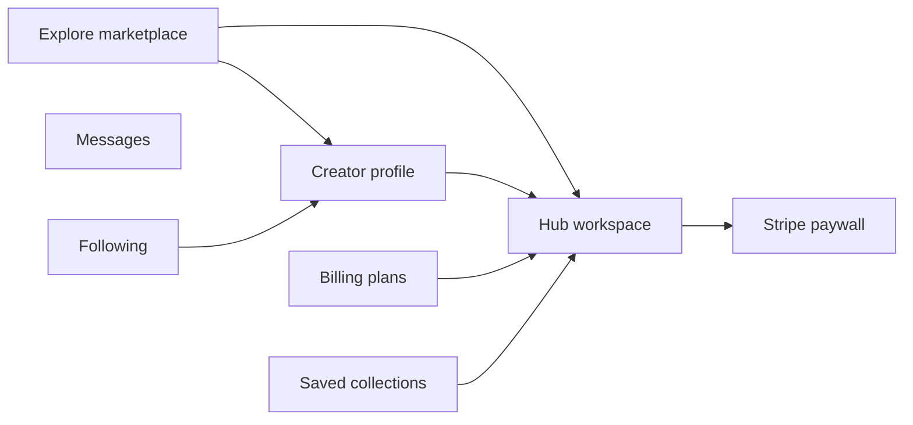
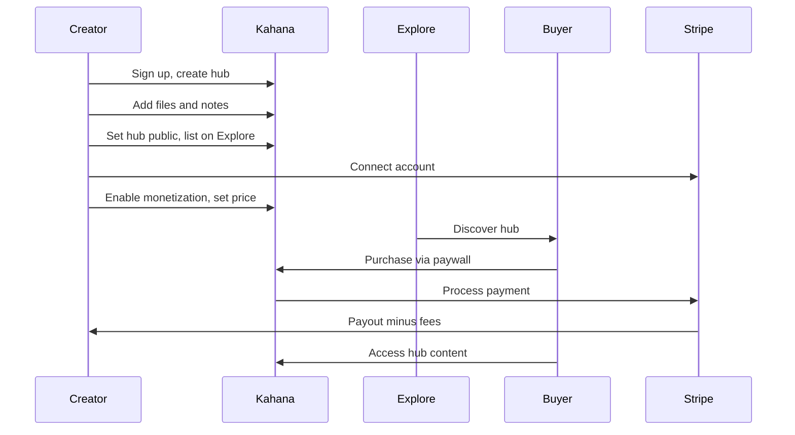
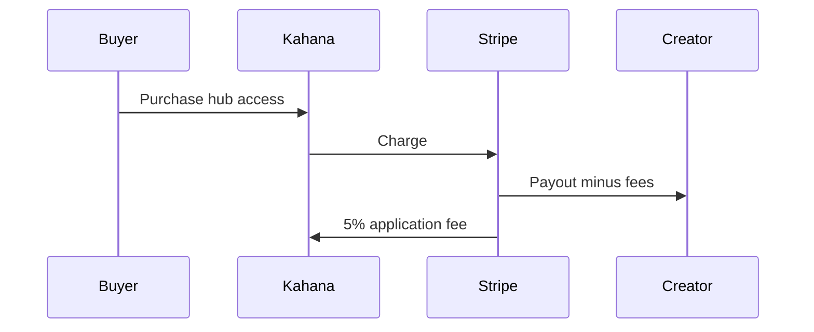
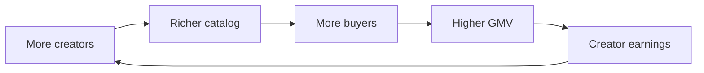

# Kahana Platform Overview

**Canonical platform document** for internal team onboarding, business plan generation, data-room knowledge bases, and marketing website content extraction.

> **Legacy note:** Earlier internal docs and some data-room files refer to **Curio** and `curio.store`. The product is officially **Kahana** (trademarked for software platform). Primary URL is **https://app.kahana.io**. This document supersedes legacy Curio naming for product and GTM purposes.

---

## How to use this document

| Audience | Start here |
|----------|------------|
| New team member | [Executive summary](#executive-summary) → [Platform architecture](#platform-architecture) → [User journeys](#user-journeys) |
| Business plan / investor draft | Parts A + C + [Unit economics](#unit-economics) |
| Marketing website workspace | [Marketing extraction map](#marketing-extraction-map) + `> Marketing copy:` blocks |
| Data-room / KB ingestion | Full document; stable section IDs in headings (e.g. `{#explore-marketplace}`) |
| Engineers verifying claims | [Key code locations](#key-code-locations) |

**Conventions:**

- **Product fact** — Verified against shipped product or codebase as of `last_verified`.
- **`[FILL IN: …]`** — Confidential or evolving data your team must supply (revenue, headcount, CAC, etc.).

---

## {#executive-summary} Executive summary

Kahana is building the **Amazon of digital products**: one trusted marketplace where buyers discover curated digital goods and creators host, sell, and grow their catalogs. Kahana combines a public marketplace (**Explore**), creator storefronts (**profiles + hubs**), built-in commerce (**Stripe Connect paywalls**), and collaboration tooling under a single brand at **https://app.kahana.io**.

**North star:** Make Kahana a beloved place to discover curated human knowledge — where anyone could spend an eternity exploring.

**Legal entity:** Kahana Group Inc.

**Traction (2026):**

| Metric | Current |
|--------|---------|
| Registered users | 6,500+ and growing |
| Growth MRR | ~$300/month (~$9.99/mo tier) |
| Marketplace take rate | 5% on hub sales (spiky when creators monetize) |

**Strategic pillars:**

| Pillar | Focus |
|--------|-------|
| **Catalog density** | More quality public hubs across marketplace categories |
| **Conversion** | Explore → hub view → purchase with minimal friction |
| **Creator earnings** | Help creators make money so they stay and refer others |
| **Platform revenue** | Scale GMV (marketplace take rate) and Growth MRR in parallel |

> **Marketing copy:** Kahana is where creators publish curated digital hubs, get discovered on a real marketplace, and get paid—without stitching together Gumroad, Notion, and link-in-bio tools.

### What Kahana is

- A **marketplace** (Explore at `/explore`) for public hubs and creators
- A **creator storefront** (profiles + monetized hubs)
- A **collaboration layer** (hubs with files, notes, unlimited collaborators on Free)
- A **SaaS platform** (Free / Growth / Enterprise tiers for creators who need scale)

### What Kahana is not

- Not a generic cloud drive or Dropbox alternative
- Not only an internal team wiki (though hubs support collaboration)
- Not a full LMS or course platform (though creators can sell course-like content in hubs)
- Not a social network—discovery is catalog- and creator-led, not feed-led

---

## {#vision-library} Vision: The Library

> *"I could spend an eternity in here."* — Professor Zei, on Wan Shi Tong's Library (*Avatar: The Last Airbender*)

Kahana aspires to be like **Wan Shi Tong's Library** — a vast, mesmerizing repository where seekers lose themselves in curated knowledge. Not a cold transaction machine, but a beloved place to discover digital artifacts from the world's best experts, creators, and influencers.

| Wan Shi Tong parallel | Kahana expression |
|----------------------|-------------------|
| Vast repository of books, scrolls, artifacts | Explore marketplace + curated hubs across 16 categories |
| Knowledge Seekers collect and guide visitors | Creator partners + platform discovery and filters |
| Exchange: contribute knowledge to earn access | Creators publish hubs; buyers discover free and paid content |
| Mesmerizing depth — spend an eternity exploring | Explore UX that rewards curiosity (the Professor Zei bar) |

**Commitments:**

- Substantial **free, quality content** for humanity — not paywall-everything
- Curate for **learning and empowerment**, not weaponized knowledge
- **Women experts and women audiences** as our first GTM priority

**Two layers:** Operationally, Kahana is the *Amazon of digital products* (selection, trust, convenience, scale). Visionally, we strive to become a **trusted library for humanity** — something beyond pure transaction.

**Full story:** [/kahana-narrative](/kahana-narrative) · [12 — Strategic narrative](./Kahana/12-strategic-narrative.md)

---

## {#strategic-narrative} Strategic narrative

High-level story for onboarding and marketing alignment — why now, what's broken, what Kahana builds instead.

| Beat | Summary |
|------|---------|
| Big change | AI slop, doom-scrolling, Wikipedia limits — discovery replaced by engagement-bait |
| Stakes | Attention platforms win; experts and serious learners lose |
| Old way fails | Patreon tiers, Substack newsletters, Gumroad naked downloads — format-first, not library-first |
| Core gap | No home for outcome-oriented expert artifact libraries |
| New way | Kahana **hubs** — flexible, multi-format environments around skills and outcomes |
| Magic gifts | Form freedom, flexible pricing, safer assets (creators); trustworthy discovery (learners) |
| Promised land | Default answer to "where do I find resources for what I'm building?" |
| Horizon | Provenance, structured catalogs, infrastructure |

**Data room:** [/kahana-narrative](/kahana-narrative) · **Markdown:** [12 — Strategic narrative](./Kahana/12-strategic-narrative.md) · **Competitors:** [/kahana-competitors](/kahana-competitors)

---

## {#brand-and-urls} Brand and URLs

| Item | Value |
|------|-------|
| **Product name** | Kahana |
| **Legal entity** | Kahana Group Inc. |
| **Primary app URL** | https://app.kahana.io |
| **Legacy product name** | Curio (deprecated in GTM; may appear in old docs or redirects) |
| **Legacy URL** | curio.store / kahana-alpha.herokuapp.com (may redirect or alias; app.kahana.io is canonical) |

**Product fact:** Production frontend deploys to Heroku (`kahana-alpha`); backend API on Firebase project `kahana-15c2a`. Staging uses Firebase `kahana-dev` and Heroku `curio-beta`.

---

## {#positioning} Positioning

### Positioning statements

**For creators** who package expertise into digital products, **Kahana** is a **marketplace and storefront** that lets them publish curated hubs, get discovered on Explore, and monetize with Stripe—unlike generic file hosts or link-in-bio tools that don't offer discovery or built-in commerce.

**For buyers**, Kahana is a **curated digital marketplace** where they find high-signal products in public hubs—unlike scattered PDFs, Notion pages, or one-off Gumroad links with no browse experience.

### "Amazon of digital products" frame

| Dimension | Amazon parallel | Kahana expression |
|-----------|-----------------|-------------------|
| **Selection** | Huge catalog, every category | Explore marketplace with 16 standard categories, hub + creator discovery |
| **Trust** | Reviews, returns, known sellers | Creator profiles, clear pricing, moderation (adult-content gating), Stripe checkout |
| **Convenience** | One account, fast checkout | Single platform for browse → buy → access; Linktree-style profiles |
| **Scale** | Marketplace economics improve with volume | Stripe Connect take rate + SaaS subscriptions; tools that reward catalog depth |

---

## {#market-and-customers} Market and customers

### Primary ICP hypotheses

Validate with data; mark confirmed segments in `[FILL IN]` fields.

**1. Solo creators and influencers**

- Coaches, educators, social creators, newsletter writers packaging guides, templates, or resource libraries
- **Job to be done:** Turn audience attention into revenue without building a custom site
- **Why Kahana:** Explore discovery + profile links + monetized hub in one stack
- `[FILL IN: % of current GMV or hub count from this segment]`

**2. Consultants and subject-matter experts**

- Professionals selling playbooks, frameworks, or niche expertise (business, marketing, finance, wellness)
- **Job to be done:** Productize knowledge once; sell repeatedly
- **Why Kahana:** Hub as structured product container; categories match expertise verticals
- `[FILL IN: top 3 creator examples or case studies]`

**3. Teams and organizations (Enterprise)**

- Companies needing white-label hubs, unified billing, or internal + external knowledge products
- **Job to be done:** Deploy a Kahana-like experience under their brand with support
- **Why Kahana:** Enterprise tier—custom branding, integrations, dedicated support
- `[FILL IN: pipeline count and average deal size]`

### Jobs to be done

| Actor | Functional job | Emotional job | Kahana feature |
|-------|----------------|---------------|----------------|
| **Creator** | Publish and sell digital products | Feel professional; earn sustainably | Hubs, Stripe, Explore, Profile |
| **Creator** | Get discovered without ads | Hope the catalog finds buyers | Explore categories, search, OG share |
| **Buyer** | Find trustworthy products fast | Avoid scams and low-quality PDFs | Profiles, pricing clarity, moderation |
| **Buyer** | Access content after purchase | Instant gratification | Paywall → hub access |
| **Team buyer** | Procure at scale | Vendor confidence | Enterprise sales motion |

### Marketplace categories

**Product fact:** Kahana ships **16 standard marketplace categories** (from `src/constants/hubCategories.js`):

| Slug | Label |
|------|-------|
| beauty | Beauty & Skincare |
| fashion | Fashion & Style |
| health-wellness | Health & Wellness |
| sports-fitness | Sports & Fitness |
| finance | Finance |
| business | Business |
| lifestyle | Lifestyle |
| education | Education |
| technology | Technology |
| creative | Creative & Design |
| marketing | Marketing |
| productivity | Productivity |
| entertainment | Entertainment |
| spirituality | Spirituality |
| writing | Writing & Publishing |
| other | Other |

**Priority categories** (featured in Explore ordering): beauty, fashion, health-wellness, sports-fitness, finance, business, lifestyle.

Creators may also add **custom tags** alongside standard categories.

### Market sizing (placeholders)

| Horizon | GMV target | MRR target | Monetized hubs |
|---------|------------|------------|----------------|
| Year 1 | [FILL IN] | [FILL IN] | [FILL IN] |
| Year 2 | [FILL IN] | [FILL IN] | [FILL IN] |
| Year 3 | [FILL IN] | [FILL IN] | [FILL IN] |

TAM / SAM / SOM: [FILL IN with methodology and sources]

---

## {#competitive-landscape} Competitive landscape

| Competitor | Strength | Kahana differentiation |
|------------|----------|--------------------------|
| **Gumroad** | Simple digital sales, creator trust | Kahana adds **discovery** (Explore), **hub as product container**, and **collaboration** |
| **Stan Store / link-in-bio** | Mobile-first creator links | Kahana adds **marketplace browse**, richer hub content, and **category taxonomy** |
| **Patreon** | Recurring membership and community | Curated product libraries and marketplace discovery, not feed-only membership |
| **Substack** | Newsletter publishing and subscriber community | Multi-format hubs and Explore browse beyond email-first writing |
| **Udemy** | Course marketplace discovery | Multi-format hubs, creator-owned storefronts, not video-only courses |
| **Kajabi / Teachable** | Courses and memberships | Kahana is **lighter-weight and hub-centric**; better for curated resource bundles |
| **Notion / Coda** | Flexible docs and workspaces | Kahana is **commerce- and discovery-first**; monetization and public marketplace are core |

**Customer stack Kahana replaces:** Gumroad or Stan (sales) + Notion/Drive (delivery) + Linktree (bio links) + social for audience → **one platform**.

**Full landscape:** [/kahana-competitors](/kahana-competitors) (interactive) · [11 — Competitive landscape](./Kahana/11-competitive-landscape.md) (markdown)

**Note:** Oasis Browser competitor database (Island, Surf, etc.) lives at [/competitors](/competitors) (archive) — separate product.

---

## {#platform-architecture} Platform architecture

Kahana is a React single-page application backed by Firebase (Firestore, Auth, Cloud Functions) and Stripe for payments.



### Product surfaces

| Surface | Route | Purpose |
|---------|-------|---------|
| **Home / My hubs** | `/` | Creator dashboard; hub library, recents, create |
| **Explore** | `/explore` | Discover public hubs and creators; search and filters |
| **Hub** | `/hub/:id` | Curated digital product container—files, notes, collaboration, paywall |
| **Profile** | `/profile/:userId` | Public creator page—avatar, bio, social links, hub links |
| **Profile settings** | `/profile/:userId/settings` | Edit profile, links, images |
| **Billing** | `/billing` | Free / Growth / Enterprise plan selection |
| **Settings** | `/settings` | Account, billing, notifications, preferences |
| **Saved** | `/saved` | Saved hub collections |
| **Following** | `/following` | Creators the user follows |
| **Messages** | `/messages` | Direct messages between users |
| **Analytics** | `/analytics` | Creator analytics (surface exists; depth varies by plan) |
| **Monetization** | `/monetization/:workspaceId` | Connect Stripe, set hub pricing |
| **Collaboration invite** | `/collaboration/:workspaceId/:inviteId` | Accept hub collaborator invite |
| **Feedback** | `/feedback` | User feedback submission |
| **Legal** | `/legal/*` | Hub access, privacy, monetization, adult content, public listing policies |

---

## {#core-concepts} Core concepts (glossary)

| Term | Definition |
|------|------------|
| **Hub / workspace** | Kahana's core product unit—a container for files, notes, collaborators, and optional monetization. Used interchangeably in code (`workspace`) and product copy (`hub`). |
| **Explore** | Public marketplace at `/explore` for discovering hubs and creators. |
| **Public hub** | Hub with public sharing enabled; eligible for Explore listing when indexed. |
| **Monetized hub** | Hub with Stripe pricing enabled; buyers pay via paywall to access content. |
| **Paywall** | Checkout modal/flow on a hub; Stripe Connect processes payment; buyer receives READ access. |
| **Creator profile** | Link-in-bio style public page listing creator info and public hubs. |
| **Growth tier** | Paid SaaS plan ($9.99/mo or $99.99/yr default) for unlimited hubs/uploads and higher limits. |
| **Take rate** | Platform application fee on hub sales (5% of transaction). |
| **Age verification** | Logged-in users enter date of birth; server sets `ageVerifiedAt` if ≥ 18. Required for adult content. |
| **Verified creator badge** | Stripe Identity verification indicator on creator profile/paywall. |

---

## {#explore-marketplace} Explore marketplace

Explore is Kahana's public discovery surface. Buyers and guests browse without an account; adult content requires login and age verification.

**Product fact:** Explore has **Hubs** and **Creators** tabs with shared filter tooling.

### Filters (shipped)

- Text search
- Category (16 standard categories)
- Monetization (free vs monetized)
- Price range
- Adult content (include / exclude / only)
- Custom tags
- Sort (including relevance when searching)
- Format and additional filter drawers on mobile/desktop

> **Marketing copy:** Browse a curated marketplace of digital products—templates, guides, playbooks, and resource libraries—organized by category, price, and creator.

---

## {#hubs} Hubs

A **hub** is Kahana's core product unit—a workspace that can be public or private, monetized or free, and filled with files and notes.

**Product fact:** Public hubs with appropriate sharing settings appear on Explore and creator profiles when listed/indexed.

### Capabilities

- **Files** — Upload and organize digital assets (size limits vary by plan)
- **Notes** — Structured text content alongside files
- **Collaborators** — Invite others with role-based access; unlimited on Free tier
- **Monetization** — Stripe Connect paywall (one-time or monthly subscription)
- **Hub settings** — Title, description, cover, categories/tags, accent color, adult content flag, Explore listing, paywall storefront configuration
- **View counts** — Displayed on marketplace cards and profiles
- **Fork** — Duplicate a hub structure (where permitted)

### Hub settings studio

Creators manage listing readiness, Explore preview, monetization gates, and design (including accent color) from hub settings. Save validation is enforced server-side on workspace PATCH.

---

## {#creator-profiles} Creator profiles

**Product fact:** Profiles use a Linktree-style layout—centered column, full-width link buttons, public hubs stacked below.

### Shipped

- Avatar and optional background image
- Name, bio, tagline
- Social links (Instagram, X, TikTok, LinkedIn) plus custom labeled links
- Public hub links with view counts and monetization indicators
- Open Graph metadata for social sharing
- **Verified creator badge** — Indicates Stripe Identity verification for creators who completed identity checks

> **Marketing copy:** Your Kahana profile is your creator homepage—one link for your bio that showcases every hub you sell.

---

## {#monetization-and-payments} Monetization and payments

**Product fact:** Creators connect **Stripe** via Stripe Connect. Buyers pay through a hub paywall. Platform application fee: **5%** (`APPLICATION_FEE_PERCENT` in backend).

### Creator flow

1. Connect Stripe account (Stripe Connect onboarding)
2. Enable monetization on a hub; set price and payment type (one-time or monthly)
3. Hub appears with paywall for non-purchasers
4. Buyer completes Stripe checkout
5. Buyer receives hub access; creator receives payout minus Stripe fees and platform fee

### Buyer checkout flow

1. Open monetized hub (direct link, profile, or Explore)
2. View storefront / order summary in paywall modal
3. Accept terms; enter payment via Stripe Elements
4. On success, hub content unlocks

**Product fact:** Paywall creator account is resolved via `/monetization/paywall/:workspaceId` API and `workspace.creatorAccount` on the hub document.

**Product fact:** Free trials on hubs are supported where configured (`startTrial` API).

### Payment types

| Type | Description |
|------|-------------|
| **ONETIME** | Single purchase; lifetime hub access |
| **MONTHLY** | Recurring subscription for hub access |

Stripe processing fees (~2.9% + $0.30 US cards) apply separately and are borne by the payment flow standard for Connect.

> **Marketing copy:** Sell digital products with built-in checkout. Connect Stripe once, set your price, and Kahana handles the paywall—keeping 5% to run the marketplace.

---

## {#plans-and-limits} Plans and limits

| Feature | Free | Growth | Enterprise |
|---------|------|--------|------------|
| Price | $0 | $9.99/mo or $99.99/yr | Custom |
| Hubs | 3 | Unlimited | Unlimited |
| Uploads per hub | Up to 10 | Unlimited | Unlimited |
| Collaborators | Unlimited | Unlimited | Unlimited |
| Stripe monetization | Yes | Yes | Yes |
| Max file size | 5 MB | 5 GB | Flexible |
| Storage | — | 100 GB | Flexible |
| Support | — | Live chat | 24/7 white-glove |
| Extras | — | — | White-label, custom integrations, analytics (beta), migration support |

**Product fact:** Growth default pricing from codebase: $9.99/month, $99.99/year (~17% annual savings vs monthly).

**Product fact:** Growth features marketed in-app: unlimited hubs, unlimited uploads per hub, live chat support, 100 GB storage, 5 GB max file size.

### Free → Growth trigger moments

- Attempt to create 4th hub
- Upload limit hit on hub
- Large file upload rejected (>5 MB on Free)
- Creator requests support (Growth includes live chat)

`[FILL IN: current Free → Growth conversion rate]`

---

## {#trust-and-safety} Trust and safety

### Adult content

**Product fact:** Creators can flag hubs as adult content (`isAdultContent`). Explore supports adult content filters (include / exclude / only).

### Age verification policy (current)

**Product fact:** Adult content access requires:

1. **Account** — Guest users must log in or create an account (no anonymous "I am 18" session unlock)
2. **Date of birth** — Logged-in users enter DOB; server validates age ≥ 18 via `POST /users/me/age_verify` and stores `ageVerifiedAt` on the user record
3. **Hub access** — Anonymous API does not grant READ on adult hubs until age-verified access exists

Legal policy pages: `/legal/adult-content`, `/legal/hub-access`, `/legal/hub-privacy`, `/legal/creator-monetization`, `/legal/public-hub`, `/legal/content-protection`.

### Creator verification

Stripe Identity verification can display a verified creator badge on profiles and paywall surfaces.

### Moderation gaps

`[FILL IN: reporting flow, manual review queue, prohibited content enforcement process]`

---

## {#collaboration-and-social} Collaboration and social

| Feature | Route | Description |
|---------|-------|-------------|
| **Collaboration invites** | `/collaboration/:workspaceId/:inviteId` | Invite users to a hub with a role |
| **Direct messages** | `/messages` | User-to-user messaging |
| **Following** | `/following` | Follow creators; `[FILL IN: buyer notification roadmap]` |
| **Saved collections** | `/saved` | Save hubs to collections for later |

**Product fact:** Free tier includes unlimited collaborators per hub.

---

## {#user-journeys} User journeys

### Creator: publish and earn



1. Sign up → create hub → add files/notes
2. Set hub public → list on Explore (when requirements met)
3. Connect Stripe → enable monetization
4. Share profile link or rely on Explore discovery
5. Optional: upgrade to Growth for unlimited hubs/uploads

### Buyer: discover and purchase

1. Land on Explore or creator profile (or direct hub link)
2. Browse/filter → open hub
3. If adult hub: log in → enter date of birth → confirm age
4. If monetized: pay via Stripe paywall → access hub content
5. Optional: collaborate if invited

### Guest vs logged-in on public hubs

- **Non-adult public hubs:** Guests may receive read-only preview access per API rules
- **Adult public hubs:** Age gate before content; no anonymous READ grant
- **Monetized hubs:** Paywall before full content regardless of auth state

---

## {#current-limitations} Current limitations (honest)

Kahana is **not yet** at Amazon-scale in these areas:

| Gap | Impact | Reference |
|-----|--------|-----------|
| Hub UX friction | Share/monetize discoverability, upload entry points | [Hub UX backlog](./hub-ux-investigation/prioritized-backlog.md) |
| No reviews/ratings | Weaker trust signal vs Amazon/Gumroad | Roadmap H1 |
| Limited recommendations | Browse-heavy, not personalized | Roadmap H2 |
| Creator analytics depth | Limited payout/performance dashboards | Enterprise beta; roadmap H2 |
| Search depth | Functional but not semantic/discovery-optimized | Roadmap H2 |
| Following → notifications | Follow exists; buyer alerts `[FILL IN: roadmap]` | Roadmap |

---

## {#revenue-model} Revenue model

Kahana earns from **three streams**: creator SaaS subscriptions (Growth), **marketplace take rate** on hub sales (5%), and **Enterprise** contracts.

| Stream | Mechanism | Product fact |
|--------|-----------|--------------|
| **Growth SaaS** | Monthly or annual subscription | $9.99/mo · $99.99/yr default |
| **Marketplace take rate** | Application fee on hub sales | 5% |
| **Enterprise** | Custom contracts | Contact sales; white-label, analytics beta |

Free tier is **$0** but enables Stripe monetization—acts as top-of-funnel for GMV and future Growth conversion.

### Marketplace transaction flow



### Revenue mix (placeholders)

| Metric | Current | Target (12 mo) | Target (36 mo) |
|--------|---------|----------------|----------------|
| Registered users | 6,500+ | [FILL IN] | [FILL IN] |
| MRR (Growth) | ~$300/mo | [FILL IN] | [FILL IN] |
| Monthly GMV | Spiky (creator-driven) | [FILL IN] | [FILL IN] |
| Take-rate revenue | 5% of hub sales | [FILL IN] | [FILL IN] |
| Enterprise ARR | [FILL IN] | [FILL IN] | [FILL IN] |

### Key metrics definitions

| Metric | Definition |
|--------|------------|
| **MRR** | Sum of active monthly-equivalent subscription revenue |
| **GMV** | Gross merchandise value—all hub sales before fees |
| **Take rate** | Platform fee % on GMV (5% today) |
| **Monetized hub** | Public hub with active Stripe monetization |
| **Conversion** | Explore session → hub purchase |

---

## {#growth-strategy} Growth strategy

### Primary GTM: women-first expert curation

The key to go-to-market is simple: **discover, filter, and select** high-quality women experts, creators, and influencers — then **invite** them to partner and showcase their work on Kahana.

| Step | Action |
|------|--------|
| **Discover** | Find women experts, coaches, educators, influencers packaging digital knowledge |
| **Filter** | Assess catalog quality, audience fit, expertise depth |
| **Invite** | Partner and onboard; showcase hubs on Explore and profiles |
| **Amplify** | Featured creators, category campaigns (beauty, fashion, health-wellness, lifestyle) |

**ICP priority:** Supply = women experts packaging guides, templates, resource libraries. Demand = women audiences seeking trusted, curated expertise.

**Not yet:** Paid ads at scale; enterprise outbound — creator-led + curated partnerships first.

### Marketplace flywheel



**When growth stalls, priority order:**

1. No catalog → recruit creators; reduce publish friction
2. No traffic → distribution and SEO
3. No conversion → paywall, trust, hub page quality
4. No retention → creator success and product value

### Acquisition channels (hypothesis order)

| Priority | Channel | Mechanism |
|----------|---------|-----------|
| 1 | Creator-led distribution | Profile links, OG previews, social |
| 2 | Explore SEO | Category pages, public hub URLs |
| 3 | Partnerships | Featured creators, category campaigns |
| 4 | Paid | `[FILL IN: when CAC model supports]` |

### Funnel stages

| Stage | Definition | Target metric |
|-------|------------|---------------|
| **Awareness** | Visit Explore or profile | Unique visitors |
| **Interest** | Open hub page | Hub views / visitor |
| **Intent** | Open paywall / checkout | Checkout starts |
| **Purchase** | Complete Stripe payment | GMV, conversion rate |
| **Retention** | Second purchase or creator publish | Repeat rate |

---

## {#unit-economics} Unit economics

All dollar values below are **placeholders** until finance populates real data.

### Creator value model (annual)

```
Creator value to Kahana =
  (Growth ARPU × subscription probability)
  + (Annual GMV × 5% take rate × activity probability)
  + (Enterprise allocation × enterprise probability)
```

| Input | Value |
|-------|-------|
| Growth monthly price | $9.99 |
| Growth annual price | $99.99 |
| Take rate | 5% |
| Avg annual GMV per monetized creator | [FILL IN] |

### LTV : CAC targets

| Segment | LTV (12 mo) | CAC | Target LTV:CAC |
|---------|-------------|-----|----------------|
| Monetized creator | [FILL IN] | [FILL IN] | > 3:1 |
| Growth subscriber | [FILL IN] | [FILL IN] | > 3:1 |
| Enterprise | [FILL IN] | [FILL IN] | > 5:1 |

---

## {#roadmap-snapshot} Roadmap snapshot

| Horizon | Timeframe | Theme | Success looks like |
|---------|-----------|-------|-------------------|
| **H1** | Now – 6 mo | Trust + conversion | More purchases per Explore visit |
| **H2** | 6 – 18 mo | Catalog scale | Buyers find the right hub fast; creators see ROI |
| **H3** | 18+ mo | Platform moat | Network effects, enterprise, hard to replicate |

### H1 highlights (0–6 months)

- Hub UX: share + monetize discoverability (P0)
- Category landing pages for SEO (P1)
- Reviews/ratings MVP (P1)
- Hub page merchandising improvements (P1)
- Clearer Free → Growth upgrade paths (P1)

### H2 highlights (6–18 months)

- Search improvements and recommendations
- Creator payout dashboard and hub analytics
- Featured/curated collections on Explore
- Enterprise analytics GA, white-label theming

### H3 highlights (18+ months)

- Bundles and cross-sell
- Affiliate/referral marketplace
- Enterprise marketplace catalogs

Full detail: [07 — Product roadmap](./Kahana/07-product-roadmap.md)

**Execution tracking:** Roadmap initiatives are logged and prioritized in [Linear](https://linear.app/kahana). Horizon themes here; active backlog and sprint assignment live in Linear.

---

## {#operating-system} Operating system

Kahana uses **Linear** for product backlog (feature requests, bugs, sprint prioritization) and **Slack** for async communication and escalation.

| Tool | Role |
|------|------|
| [Linear](https://linear.app/kahana) | System of record — intake, triage, daily/weekly prioritization, engineer assignment |
| [Slack](https://join.slack.com/t/kahanaworkspace/shared_invite/zt-1pdah6gwn-W6HaRPH2iy~juLOlafO2HA) | Day-to-day comms; actionable threads become Linear issues |

**Workflow:** NPS/PMF surveys and user feedback (HITL) inform what gets logged in Linear → PM prioritizes backlog → engineers pull assigned work → status updated through ship.

**Data room pages:** [/operating-system](/operating-system) (full workflow), [/sprints](/sprints) (lifecycle explainer), [/archive/oasis-sprints](/archive/oasis-sprints) (historical Oasis sprint boards).

Full detail: [08 — Team operating model](./Kahana/08-team-operating-model.md)

---

## {#technical-roadmap} Technical roadmap

Internal onboarding doc for what engineering is focused on next — organized by **Security**, **Trust**, and **Algorithm** (not replacing H1–H3 business horizons above).

| Pillar | Focus |
|--------|-------|
| **Security** | Audit remediation (July 2026) — secrets, Firestore rules, payments, access control |
| **Trust** | Creator credibility, marketplace quality, product integrity, information accuracy |
| **Algorithm** | Find what you have in mind — search, intent, in-hub findability, recommendations |

**Data room:** [/technical-roadmap](/technical-roadmap) · **Markdown:** [10 — Technical roadmap](./Kahana/10-technical-roadmap.md) · **Audit source:** `Kahana LLC - Security Audit Report.pdf` (repo root)

Execution tracked in [Linear](https://linear.app/kahana).

---

## {#team-and-metrics} Team and metrics

### Operating cadence

| Ritual | Frequency | Output |
|--------|-----------|----------|
| Metrics standup | Weekly | Top-line numbers, blockers |
| Monthly metrics review | Monthly | [Template](./Kahana/templates/monthly-metrics-review.md) |
| Quarterly business review | Quarterly | [Template](./Kahana/templates/quarterly-business-review.md) |

### North-star KPIs (dashboard spec)

| KPI | Definition | Source |
|-----|------------|--------|
| GMV | Monthly hub sales volume | Stripe / Firestore |
| MRR | Active Growth + Enterprise subscriptions | Stripe |
| Monetized hubs | Count of hubs with active monetization | Firestore |
| Explore unique visitors | Traffic to `/explore` | Mixpanel |
| Conversion rate | Explore → purchase | Mixpanel + Stripe |

**Team roster:** [FILL IN: names, roles, headcount]

Full detail: [08 — Team operating model](./Kahana/08-team-operating-model.md)

---

## {#risks} Risks and mitigations

| ID | Risk | Likelihood | Impact |
|----|------|------------|--------|
| R1 | Stripe dependency / account issues | Medium | High |
| R2 | Infrastructure outage (Heroku, Firebase) | Low | High |
| R3 | Adult content / moderation failure | Medium | High |
| R4 | Creator fraud or chargebacks | Medium | Medium |
| R5 | Competitor copies marketplace | High | Medium |
| R6 | GMV concentration in few creators | [FILL IN] | High |
| R7 | Low Free → Growth conversion | [FILL IN] | Medium |
| R8 | SEO / discovery underperforms | Medium | High |

**Mitigations (summary):**

- **R1:** Monitor Stripe Connect compliance; clear creator onboarding docs
- **R2:** Uptime monitoring; incident comms; post-incident reviews
- **R3:** Adult flags, account + DOB age verification, Explore filters, legal terms
- **R4:** Hub preview standards; chargeback tracking; refund policy
- **R5:** Ship faster on conversion and trust (reviews, analytics)

Full register: [09 — Risks and mitigations](./Kahana/09-risks-and-mitigations.md)

---

## {#technical-stack} Technical stack

| Layer | Technology |
|-------|------------|
| **Frontend** | React (Create React App), Mantine UI, Redux |
| **Frontend hosting** | Heroku + nginx buildpack |
| **Backend API** | Firebase Cloud Functions (Node.js / TypeScript) |
| **Database** | Cloud Firestore |
| **Auth** | Firebase Authentication |
| **File storage** | Firebase Storage |
| **Payments** | Stripe + Stripe Connect |
| **Analytics** | Mixpanel |
| **Email** | Firebase-triggered functions (transactional) |

---

## {#environments} Environments

| Tier | Frontend | Firebase project | Purpose |
|------|----------|------------------|---------|
| **Local** | localhost:3000 | emulators or kahana-dev | Development |
| **Staging** | curio-beta (Heroku) | kahana-dev | QA, pre-prod |
| **Production** | app.kahana.io (Heroku kahana-alpha) | kahana-15c2a | Live product |

**Deploy commands (from repo):**

- Staging frontend: `npm run deploy:staging`
- Production frontend: `npm run deploy:prod:curio` (pushes to heroku-alpha)
- Staging API: `npm run deploy` in firebase-functions/functions
- Production API: `npm run deploy:prod` in firebase-functions/functions

Detail: [scripts/deploy-staging.md](../scripts/deploy-staging.md)

**Note:** Do not deploy this React app to `kahana-public` Heroku—that hosts the marketing site repo, not the product app.

---

## {#key-code-locations} Key code locations

For engineers verifying product facts in this document:

| Area | Path |
|------|------|
| Routes / surfaces | `src/routes.js` |
| Explore marketplace | `src/views/ExplorePage/` |
| Hub workspace + age gate | `src/components/Workspace/`, `src/components/AgeGateScreen/` |
| Paywall / checkout | `src/components/PaywallModal/` |
| Age verification (client) | `src/helpers/ageVerification.js`, `src/helpers/ageVerificationHelpers.js` |
| Hub categories | `src/constants/hubCategories.js` |
| Growth pricing | `src/views/billing/components/growthPricing.js` |
| Paywall creator fetch | `src/helpers/fetchPaywallCreatorData.js` |
| Workspace API adapter | `src/actions/workspaces.js`, `src/api/adapters.js` |
| Age verify API | `firebase-functions/.../usersEndpoint.ts` (`POST /users/me/age_verify`) |
| Paywall API | `firebase-functions/.../usersEndpoint.ts` (`GET /monetization/paywall/:workspaceId`) |
| Platform fee constant | `firebase-functions/.../constants/monetizeRate.ts` |
| Adult anon access | `firebase-functions/.../workspaceEndpoint.ts` |

---

## {#marketing-extraction-map} Marketing extraction map

Use this table to derive marketing website pages and components from section IDs.

| Section ID | Suggested page / component | Hero angle | Component ideas |
|------------|---------------------------|------------|-----------------|
| `#executive-summary` | Homepage hero | "The marketplace for curated digital products" | Hero headline, subhead, primary CTA to app.kahana.io/signup |
| `#positioning` | Homepage "Why Kahana" | Replace your creator tool stack | Two-column: For creators / For buyers |
| `#explore-marketplace` | /discover or /explore | Browse digital products by category | Category grid, filter chips, screenshot carousel |
| `#hubs` | /features/hubs | Your product, organized | Feature grid: files, notes, collaborators, branding |
| `#creator-profiles` | /features/profiles | One link for your creator business | Profile mockup, social link row |
| `#monetization-and-payments` | /for-creators or /pricing | Sell with built-in checkout | Stripe badge, fee transparency (5%), paywall screenshot |
| `#plans-and-limits` | /pricing | Free to start; Growth when you scale | Plan comparison table |
| `#trust-and-safety` | /trust or /legal hub | Safe marketplace for buyers and creators | Age verification explainer, policy links |
| `#competitive-landscape` | /compare | Kahana vs Gumroad / link-in-bio | Comparison table component |
| `#user-journeys` | /how-it-works | Publish in minutes; buy in seconds | Step timeline (creator + buyer) |
| `#collaboration-and-social` | /features/collaborate | Build with your team | Icons for DMs, invites, saved |
| `#faq-seed` | /faq | — | Accordion FAQ component |
| `#roadmap-snapshot` | /about or investor page (internal) | Where we're headed | Horizon timeline (optional, internal-only) |

---

## {#faq-seed} FAQ seed

### For creators

**Q: What is a Kahana hub?**  
A: A hub is a curated container for your digital product—files, notes, and optional collaborators— that you can make public, list on Explore, and sell with built-in Stripe checkout.

**Q: How much does Kahana cost?**  
A: Free tier includes 3 hubs and Stripe monetization. Growth is $9.99/month or $99.99/year for unlimited hubs, larger uploads, and live chat support. Enterprise is custom.

**Q: What fee does Kahana take on sales?**  
A: Kahana charges a 5% platform fee on hub sales processed through Stripe Connect, in addition to standard Stripe processing fees.

**Q: Do I need Stripe?**  
A: Yes, to sell hubs you connect a Stripe account via Stripe Connect. Kahana does not hold creator funds directly.

**Q: Can I collaborate with others on a hub?**  
A: Yes. Free tier includes unlimited collaborators. Invite via collaboration links.

### For buyers

**Q: How do I buy a digital product on Kahana?**  
A: Browse Explore or a creator's profile, open a hub, and complete checkout on the paywall. After payment, you get access to the hub content.

**Q: Is adult content allowed?**  
A: Creators may flag adult hubs. Buyers must have an account and verify they are 18+ with a date of birth before accessing adult content.

**Q: Can I browse without an account?**  
A: Yes for most public hubs on Explore. Adult content and some monetized flows require login.

### General

**Q: Is Kahana the same as Curio?**  
A: Curio was a prior product name. The platform is now **Kahana**, available at **app.kahana.io**.

**Q: Who operates Kahana?**  
A: Kahana Group Inc.

---

## {#related-documents} Related documents

### Deep-dive business docs

| Doc | Topic |
|-----|-------|
| [01 — Vision and positioning](./Kahana/01-vision-and-positioning.md) | North star, Wan Shi Tong vision, Amazon ops frame |
| [02 — Product today](./Kahana/02-product-today.md) | Feature ground truth |
| [03 — Market and customers](./Kahana/03-market-and-customers.md) | ICP, women-first priority |
| [04 — Revenue model](./Kahana/04-revenue-model.md) | Revenue streams, expansion levers |
| [05 — Growth strategy](./Kahana/05-growth-strategy.md) | Flywheel, women-first GTM |
| [06 — Unit economics](./Kahana/06-unit-economics.md) | LTV, CAC, traction metrics |
| [07 — Product roadmap](./Kahana/07-product-roadmap.md) | H1–H3 horizons |
| [10 — Technical roadmap](./Kahana/10-technical-roadmap.md) | Security, Trust, Algorithm (internal) |
| [11 — Competitive landscape](./Kahana/11-competitive-landscape.md) | Creator economy market map |
| [12 — Strategic narrative](./Kahana/12-strategic-narrative.md) | Why Kahana — story beats and elevator drafts |
| [08 — Team operating model](./Kahana/08-team-operating-model.md) | Roles, cadence, KPIs |
| [09 — Risks and mitigations](./Kahana/09-risks-and-mitigations.md) | Risk register |

### Product engineering

| Doc | Topic |
|-----|-------|
| [Hub UX investigation](./hub-ux-investigation/README.md) | Near-term UX debt and backlog |
| [Deploy staging](../scripts/deploy-staging.md) | Staging/prod deploy workflow |
| [Monthly metrics template](./Kahana/templates/monthly-metrics-review.md) | Recurring metrics ritual |
| [Quarterly business review](./Kahana/templates/quarterly-business-review.md) | QBR template |

---

## {#changelog} Changelog

| Version | Date | Changes |
|---------|------|---------|
| 1.0.0 | 2026-07-06 | Initial canonical platform doc. Kahana rebrand (supersedes Curio naming). Includes adult access policy (account + DOB), paywall/Stripe flow, 16 categories, full surface map. |

---

*Doc owner: [FILL IN: name] · Questions: [FILL IN: channel]*
