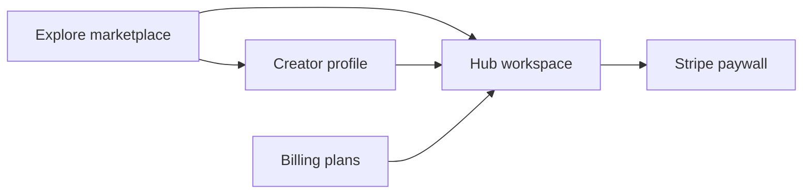

# 02 — Product Today

[← Back to index](./README.md) · Prev: [01 — Vision](./01-vision-and-positioning.md) · Next: [03 — Market](./03-market-and-customers.md)

## Executive summary

Curio today is a live product at **curio.store** with a public Explore marketplace, monetizable creator hubs, Linktree-style profiles, Stripe Connect payments, and three SaaS tiers (Free, Growth, Enterprise). This doc is **ground truth** for what ships—not roadmap.

---

## Product map

| Surface | Route / entry | Purpose |
|---------|---------------|---------|
| **Explore** | `/explore` | Discover public hubs and creators; search and filters |
| **Hub** | `/hub/:id` | Curated digital product container—files, notes, collaboration |
| **Profile** | `/profile/:userId` | Public creator page—avatar, bio, social/custom links, hub links |
| **Profile settings** | `/profile/:userId/settings` | Edit profile, links, images |
| **Billing** | Billing view | Free / Growth / Enterprise plan selection |

---

## Explore marketplace

**Product fact:** Explore has **Hubs** and **Creators** tabs with shared filter tooling.

**Filters (shipped):**

- Text search
- Category (14 standard marketplace categories)
- Monetization (free vs monetized)
- Price range
- Adult content (include / exclude / only)
- Custom tags
- Sort (including relevance when searching)

**Categories (shipped):** Business, Education, Health & Wellness, Finance, Technology, Creative & Design, Marketing, Productivity, Lifestyle, Entertainment, Spirituality, Sports & Fitness, Writing & Publishing, Other.

---

## Hubs

A **hub** is Curio's core product unit—a workspace that can be public or private, monetized or free, and filled with files and notes.

**Product fact:** Public hubs with `SINGLE_PUBLIC` sharing appear on Explore and creator profiles.

**Capabilities:**

- File uploads (size limits vary by plan)
- Notes and structured content
- Unlimited collaborators (Free tier)
- Monetization via Stripe Connect paywall
- View counts and monetization badges on marketplace cards
- Age verification gate for adult-flagged content

---

## Creator profiles

**Product fact:** Profiles use a Linktree-style layout—centered column, full-width link buttons, public hubs stacked below.

**Shipped:**

- Avatar and optional background image
- Name and bio
- Social links (Instagram, X, TikTok, LinkedIn) plus custom labeled links
- Public hub links with view counts
- Open Graph metadata for social sharing

---

## Monetization

**Product fact:** Creators connect Stripe via Stripe Connect. Buyers pay through a hub paywall. Platform application fee: **5%** on monetized transactions.

Flow:

1. Creator connects Stripe account
2. Creator sets hub as monetized with pricing
3. Buyer hits paywall on hub
4. Payment processes via Stripe; creator receives payout minus platform fee and Stripe fees

---

## SaaS plans

| Feature | Free | Growth | Enterprise |
|---------|------|--------|------------|
| Price | $0 | $9.99/mo or $99.99/yr | Custom |
| Hubs | 3 | Unlimited | Unlimited |
| Uploads per hub | Up to 10 | Unlimited | Unlimited |
| Collaborators | Unlimited | Unlimited | Unlimited |
| Stripe monetization | Yes | Yes | Yes |
| Max file size | 5 MB | 5 GB | Flexible |
| Storage | — | 100 GB | Flexible |
| Support | — | Live chat | 24/7 white-glove |
| Extras | — | — | White-label, custom integrations, analytics (beta), migration support |

**Product fact:** Growth default pricing from codebase: $9.99/month, $99.99/year (~17% annual savings).

---

## Trust and safety

**Product fact (shipped):**

- Adult content flags on hubs
- Age gate for adult content access
- Explore filters for adult content (include / exclude / only)

---

## Primary user journeys

### Creator: publish and earn

1. Sign up → create hub → add files/notes
2. Set hub public → appears on Explore (when indexed)
3. Connect Stripe → enable monetization
4. Share profile link or rely on Explore discovery
5. Optional: upgrade to Growth for unlimited hubs/uploads

### Buyer: discover and purchase

1. Land on Explore or creator profile
2. Browse/filter → open hub
3. Pass age gate if required
4. Pay via Stripe paywall → access hub content
5. Optional: collaborate if invited

---

## Current limitations (honest)

Curio is **not yet** at Amazon-scale in these areas:

| Gap | Impact | Near-term reference |
|-----|--------|---------------------|
| Hub UX friction | Share/monetize discoverability, upload entry points | [Hub UX backlog](../hub-ux-investigation/prioritized-backlog.md) |
| No reviews/ratings | Weaker trust signal vs Amazon/Gumroad | Roadmap H1 |
| Limited recommendations | Browse-heavy, not personalized | Roadmap H2 |
| Creator analytics | Limited payout/performance dashboards | Enterprise beta; roadmap H2 |
| Search depth | Functional but not semantic/discovery-optimized | Roadmap H2 |

---

## Infrastructure (for team context)

| Layer | Stack |
|-------|-------|
| Frontend | React app on Heroku (kahana-alpha → curio.store) |
| Backend | Firebase Functions (kahana-15c2a) |
| Payments | Stripe + Stripe Connect |
| Analytics | Mixpanel (events on billing, profile, enterprise CTAs) |

---

## Related docs

- [01 — Vision and positioning](./01-vision-and-positioning.md)
- [04 — Revenue model](./04-revenue-model.md)
- [07 — Product roadmap](./07-product-roadmap.md)
- [Hub UX investigation](../hub-ux-investigation/README.md)
