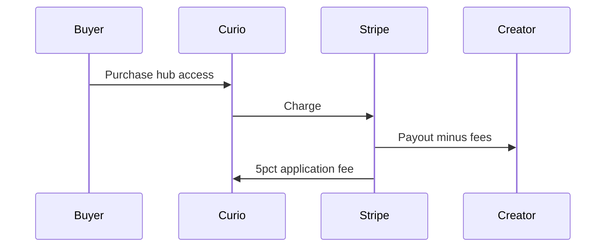
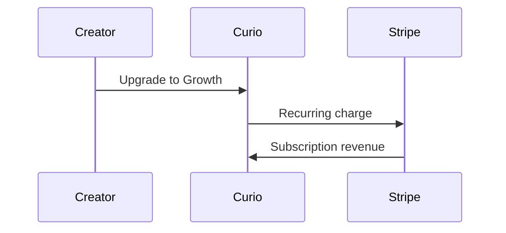

# 04 — Revenue Model

[← Back to index](./README.md) · Prev: [03 — Market](./03-market-and-customers.md) · Next: [05 — Growth strategy](./05-growth-strategy.md)

## Executive summary

Curio earns from **three streams**: creator SaaS subscriptions (Growth), **marketplace take rate** on hub sales (5% via Stripe Connect), and **Enterprise** contracts. Scaling toward "Amazon of digital products" means growing **GMV** and **MRR** together—catalog density drives transaction revenue; creator success drives subscriptions.

---

## Revenue streams today

| Stream | Mechanism | Product fact |
|--------|-----------|--------------|
| **Growth SaaS** | Monthly or annual subscription | $9.99/mo · $99.99/yr default |
| **Marketplace take rate** | Application fee on hub sales | 5% (`APPLICATION_FEE_PERCENT`) |
| **Enterprise** | Custom contracts | Contact sales; white-label, analytics beta |

Free tier is **$0** but enables Stripe monetization—acts as top-of-funnel for GMV and future Growth conversion.

---

## Money flow diagrams

### Marketplace transaction

**Notes:**

- Stripe processing fees apply separately (typically ~2.9% + $0.30 US cards)
- Creator must complete Stripe Connect onboarding to receive payouts
- [FILL IN: average hub price, transactions per month]

### SaaS subscription

---

## Revenue mix (placeholders)

| Metric | Current | Target (12 mo) | Target (36 mo) |
|--------|---------|----------------|----------------|
| MRR | [FILL IN] | [FILL IN] | [FILL IN] |
| ARR | [FILL IN] | [FILL IN] | [FILL IN] |
| Monthly GMV | [FILL IN] | [FILL IN] | [FILL IN] |
| Take-rate revenue (5% of GMV) | [FILL IN] | [FILL IN] | [FILL IN] |
| Enterprise ARR | [FILL IN] | [FILL IN] | [FILL IN] |
| % revenue from SaaS vs marketplace | [FILL IN] | [FILL IN] | [FILL IN] |

---

## Metric definitions

| Metric | Definition | Source |
|--------|------------|--------|
| **MRR** | Sum of active monthly-equivalent subscription revenue | Stripe |
| **ARR** | MRR × 12 | Derived |
| **GMV** | Gross merchandise value—all hub sales before fees | Stripe Connect / Firestore |
| **Net revenue** | Curio's take (SaaS + application fees + Enterprise) | Finance |
| **Take rate** | Platform fee % on GMV (5% today) | Code constant |
| **ARPU** | Average revenue per paying creator (SaaS + attributed GMV share) | Derived |
| **Monetized hub** | Public hub with active Stripe monetization | Firestore |
| **Conversion** | Explore session → hub purchase | Mixpanel + Stripe |

---

## Expansion levers (Amazon-scale)

### Near term (0–12 months)

1. **GMV growth** — More monetized hubs × more transactions × stable take rate
2. **Free → Growth** — Trigger upgrades at hub/upload limits (3 hubs, 10 uploads/hub on Free)
3. **Creator-led distribution** — Profile links and OG previews drive organic hub traffic
4. **Category density** — Fill thin categories so Explore feels "endless aisle"

### Medium term (12–24 months)

5. **Featured placement** — Promoted hubs (new revenue line; not shipped)
6. **Creator analytics upsell** — Deeper dashboards as Growth/Enterprise feature
7. **Annual plan push** — Improve cash flow; ~17% yearly discount already positioned in UI

### Long term (24+ months)

8. **Affiliate / referral marketplace** — Creators promote each other's hubs
9. **Bundles and cross-sell** — Multi-hub packages
10. **Enterprise marketplace** — Org-wide catalogs under white-label
11. **Adjacent services** — Email, ads, fulfillment automation (evaluate carefully)

---

## Pricing philosophy

| Principle | Application |
|-----------|-------------|
| **Free tier seeds GMV** | Let creators sell before they pay Curio SaaS |
| **Growth captures power users** | Unlimited hubs/uploads when catalog is the product |
| **Take rate aligns incentives** | Curio wins when creators win on sales |
| **Enterprise captures B2B** | High-touch, high-ACV separate motion |

[FILL IN: planned pricing changes or take-rate experiments]

---

## Key revenue questions for leadership

1. What is GMV per monetized hub per month? [FILL IN]
2. What % of creators on Free convert to Growth within 90 days? [FILL IN]
3. What is top-10 creator concentration (% of GMV)? [FILL IN]
4. Is take rate sustainable vs CAC, or do we need SaaS-heavy mix? [FILL IN: analysis]

---

## Related docs

- [02 — Product today](./02-product-today.md)
- [05 — Growth strategy](./05-growth-strategy.md)
- [06 — Unit economics](./06-unit-economics.md)
- [Monthly metrics template](./templates/monthly-metrics-review.md)
