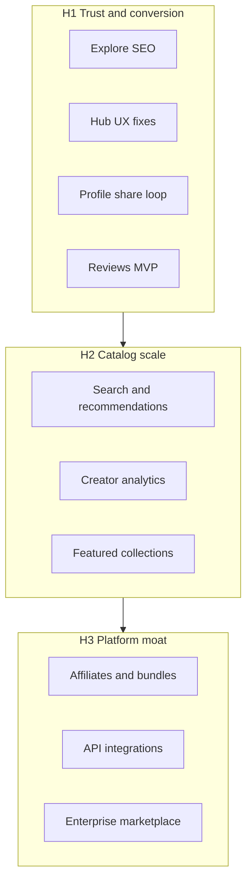

# 07 — Product Roadmap

[← Back to index](./README.md) · Prev: [06 — Unit economics](./06-unit-economics.md) · Next: [08 — Team operating model](./08-team-operating-model.md)

## Executive summary

This roadmap bridges **what Kahana ships today** to the **Amazon of digital products** vision across three horizons. It maps initiatives to existing surfaces (Explore, Hub, Profile, Billing) and links near-term debt to the hub UX investigation.

**Execution:** Horizon themes live here; active backlog items are tracked and prioritized in [Linear](https://linear.app/kahana).

**Technical focus:** For the next wave organized by Security, Trust, and Algorithm (internal onboarding), see [10 — Technical roadmap](./10-technical-roadmap.md) and the data room page at `/technical-roadmap`.

---

## Horizon overview

| Horizon | Timeframe | Theme | Success looks like |
|---------|-----------|-------|-------------------|
| **H1** | Now – 6 mo | Trust + conversion | More purchases per Explore visit |
| **H2** | 6 – 18 mo | Catalog scale | Buyers find the right hub fast; creators see ROI |
| **H3** | 18+ mo | Platform moat | Network effects, enterprise, hard to replicate |

---

## H1 — Marketplace trust and conversion (0–6 months)

**Goal:** Fix friction that blocks the core loop: discover → buy → access.

### Explore

| Initiative | Rationale | Priority |
|------------|-----------|----------|
| Category landing pages | SEO + clearer browse | P1 |
| Improved default sort and empty states | Reduce bounce | P1 |
| Social proof on cards (views, badges) | Trust | Shipped partially |

### Hub

| Initiative | Rationale | Priority |
|------------|-----------|----------|
| Share + monetize discoverability | Blockers in [UX backlog](../hub-ux-investigation/prioritized-backlog.md) | P0 |
| Consolidate upload entry points | Reduce confusion | P1 |
| Hub page merchandising (hero, description, preview) | Conversion | P1 |

### Profile

| Initiative | Rationale | Priority |
|------------|-----------|----------|
| Linktree layout + social links | Creator distribution | Shipped |
| Curio OG image on share | Brand + click-through | Shipped |

### Trust

| Initiative | Rationale | Priority |
|------------|-----------|----------|
| Reviews or ratings (MVP) | Amazon-style trust | P1 |
| Refund/dispute playbook | Creator + buyer confidence | P2 |
| Adult content moderation polish | Platform safety | Ongoing |

### Billing

| Initiative | Rationale | Priority |
|------------|-----------|----------|
| Clearer Free → Growth upgrade paths | MRR | P1 |
| Annual plan emphasis | Cash flow | Shipped in UI |

---

## H2 — Catalog scale (6–18 months)

**Goal:** Explore feels like an endless aisle; creators understand performance.

### Discovery

| Initiative | Surface |
|------------|---------|
| Search improvements (synonyms, tags, relevance) | Explore |
| Recommendations ("Related hubs") | Hub, Explore |
| Creator search filters expansion | Explore |

### Creator tools

| Initiative | Surface |
|------------|---------|
| Payout dashboard | Creator settings |
| Hub analytics (views, conversion) | Hub, Profile |
| Bulk publish / duplicate hub templates | Hub |

### Marketplace ops

| Initiative | Surface |
|------------|---------|
| Featured / curated collections | Explore |
| Category managers (editorial) | Ops process |
| Quality bar for Explore indexing | Backend |

### Enterprise

| Initiative | Surface |
|------------|---------|
| Analytics beta → GA | Enterprise |
| White-label theming | Enterprise |
| SSO / admin console | Enterprise |

---

## H3 — Platform moat (18+ months)

**Goal:** Defensible network and B2B scale.

| Initiative | Description |
|------------|-------------|
| **Affiliate marketplace** | Creators earn % promoting other hubs |
| **Bundles** | Multi-hub packages at checkout |
| **API + integrations** | Zapier, CRM, email tools |
| **Enterprise marketplace** | Org-hosted catalogs for employees or customers |
| **International** | Currency, tax, localization |
| **Mobile apps** | Native browse + purchase (if justified by GMV) |

---

## Roadmap ↔ product surface map

---

## Near-term engineering debt

Do not duplicate the investigation docs—track execution here:

| Source | Action |
|--------|--------|
| [Hub UX prioritized backlog](../hub-ux-investigation/prioritized-backlog.md) | Sprint planning for P0/P1 |
| [Bug confirmation](../hub-ux-investigation/bug-confirmation.md) | Repro before fix |
| [Mobile parity](../hub-ux-investigation/mobile-parity.md) | Include in hub UX sprints |

**Suggested Sprint A focus (from investigation):** Share/monetize menu, upload consolidation, View Notes Only error.

---

## What we are not building (H1)

- Full LMS with quizzes and certificates
- Native mobile apps
- Crypto payments
- Open API marketplace (until H3)

[FILL IN: leadership additions or cuts to this roadmap]

---

## Related docs

- [02 — Product today](./02-product-today.md)
- [05 — Growth strategy](./05-growth-strategy.md)
- [Hub UX investigation](../hub-ux-investigation/README.md)
