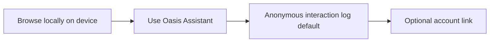

# Your data and Oasis Assistant training

**Version:** v1.0.0.12 (`8ecad89`)  
**Audience:** Oasis users, support, and marketing copy reviewers  
**B2C narrative:** [REFUGE copy bank](../b2c-refuge-promised-land-copy.md) (tease promises) · [gift mapping](b2c-magical-gifts-mapping.md) (Gift 2 proof) · Checklist `/marketing-narrative-checklist` (B2C Promised Land)  
**Technical reference:** [privacy-data-and-telemetry.md](../product/privacy-data-and-telemetry.md) · [training-and-feedback.md](../product/training-and-feedback.md)

> **Legal review:** Have legal sign off before using this text in ads, App Store listings, or public web pages.

Token: `[[REFUGE_DATA_BRIEF]]` → `/b2c-strategic-narrative#refuge-data-promises`

---

Oasis is built for deep work. Your full browsing history and bookmarks are **not** uploaded as a profile for ad companies to mine. When Oasis improves the product, it focuses on the **assistant experience** you choose to use, so the assistant can become more accurate, faster, and more helpful while you stay in flow.

---

## Your browsing stays on your device

What you read, bookmark, and open stays on **your machine** for everyday browsing and for assistant features that search your tabs, groups, and history.

| What | Where it lives |
|------|----------------|
| Browsing history and bookmarks | Firefox **Places** on your device |
| Searchable memory (tabs, groups, bookmarks, history) | Local index in **IndexedDB** on your device |
| Semantic history search | History embeddings built **on your device** with a local model (no remote model download hub) |
| Assistant chat UI state | **IndexedDB** in the browser |

Your history helps **you** inside Oasis on your computer; it is not packaged and sold as a browsing profile.

Oasis also inherits **Firefox Enhanced Tracking Protection**, which blocks many cross-site trackers and tightens third-party cookies. That reduces how much of your browsing leaks to the ad ecosystem, but it does **not** block every ad or every tracker on the web. Details: [browser-privacy-security.md](../product/browser-privacy-security.md).

---

## What Oasis collects: assistant improvement only

The only product data Oasis collects for improvement is tied to **how you use the Oasis Assistant**, not a wholesale export of everything you browse.

### Anonymous by default

For new profiles, **Personalize Oasis Assistant with my account** is **off** under **Privacy & Security → Oasis Data Collection and Use**.

With that setting off:

- Interaction logs are stored **without your account id or email**.
- Oasis cannot tie those logs back to you for personalization.
- This is the default we recommend unless you want account-linked personalization.

### Why we collect it

We use assistant interaction data to make Oasis more accurate, faster, and more helpful, so you can do deep work and accomplish more with fewer wrong turns, tab hunts, and misfires.

### What anonymous logs can still include

“Anonymous” means **not linked to your account**, not “nothing leaves your device.” When you use the assistant, Oasis may still send:

- Your prompt and the assistant’s reply
- The active tab’s URL and title (when you use the assistant)
- Which tools ran and short summaries of their results
- Browser/OS metadata and token counts

That data helps us understand what worked and what did not, without attaching it to your identity.

### Optional: personalize with your account

If you turn **Personalize Oasis Assistant with my account** **on**, the same kinds of interaction data may be stored **with** your account so Oasis can personalize responses and improve features for signed-in users. You control this anytime in Privacy settings.

### Important to know

- **Using the assistant** still uses network AI services to generate answers. That is separate from the product-improvement logging described above.
- This Oasis data collection is **not** the same as Mozilla Firefox Toolkit telemetry. In many Oasis builds, Mozilla’s own telemetry controls are hidden; your Oasis assistant choice still applies.
- Anonymous logging is **not** “zero data.” It is **no account linkage** on those logs by default.

---

## Training: help Oasis learn, earn tokens back

You can train Oasis directly from assistant replies with a thumbs up or thumbs down, plus an optional comment and badges.

When your training submission **qualifies**, you receive **+1,000 bonus AI tokens** added to your **daily cap for today (UTC)**. Thoughtful training helps the product; the token bonus is our way of giving capacity back for the same day.

### How to qualify for the bonus

You must be **signed in**. Your submission needs:

- A chosen **category**
- At least **one badge**
- A comment of at least **30 characters**

The bonus applies for the **UTC calendar day** you submit. It does **not** roll over to the next day.

You can submit training in **anonymous** or **personalized** mode on the feedback form. Anonymous training does not attach your user id to the feedback row, but if you are signed in and your submission qualifies, bonus tokens still credit your account for that day.

---

## What we do not do

- We do **not** sell your browsing history to advertisers.
- We do **not** claim “zero data” or “zero tracking” on the entire web.
- We do **not** promise that assistant logging alone blocks third-party browsers’ AI telemetry (for example Gemini-in-Chrome-style linked pipelines).

For launch and marketing copy tied to privacy gifts, see [b2c-magical-gifts-mapping.md](b2c-magical-gifts-mapping.md) (Gift 2). REFUGE tease promises live in [b2c-refuge-promised-land-copy.md](../b2c-refuge-promised-land-copy.md).

---

## Related reading

| Document | For |
|----------|-----|
| [privacy-data-and-telemetry.md](../product/privacy-data-and-telemetry.md) | Technical spec: prefs, payloads, database |
| [training-and-feedback.md](../product/training-and-feedback.md) | Training modes, migrations, grant rules |
| [oasis-capability-index.md](../product/oasis-capability-index.md) | Full v1.0.0.12 capability hub |

---

## For engineers (implementation pointers)

| Topic | Code / config |
|-------|----------------|
| Local memory index | `browser/base/content/assistant/build/src/services/localMemory.ts` |
| Semantic history + IndexedDB | `browser/base/content/assistant/build/src/services/semanticHistorySearch.ts` |
| Local embeddings (WASM) | `browser/base/content/assistant/build/src/services/embeddingService.ts` |
| Chat IndexedDB | `browser/base/content/assistant/ui-preact/src/chatStore/index.ts` |
| Anonymous vs identified consent | `browser/base/content/assistant/build/src/services/telemetryConsent.ts` |
| Default pref off | `browser/app/profile/firefox.js`: `datareporting.healthreport.uploadEnabled` |
| Token bonus constants | `browser/base/content/assistant/ui-preact/src/utils/trainingRewards.ts` |
| Grant handoff | `supabase/FEEDBACK_TOKEN_GRANTS_HANDOFF.md` |
