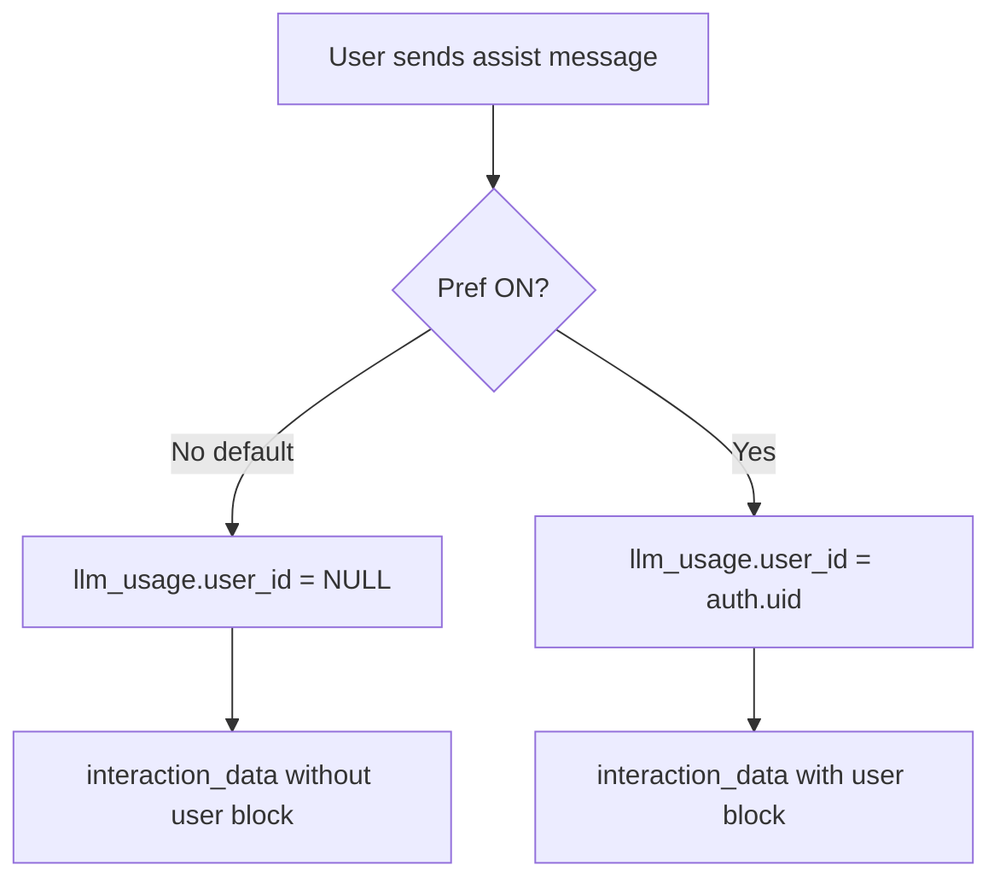

# Privacy, data collection, and interaction telemetry

**Version:** v1.0.0.12 (`8ecad89`)  
**Provenance:** Oasis-shipped (assistant + privacy UI + Supabase)

---

## What this is (and is not)

| | Oasis interaction telemetry | Mozilla Toolkit telemetry |
|---|---------------------------|---------------------------|
| **Purpose** | Improve Oasis Assistant (product analytics, training alignment) | Firefox-wide telemetry / health report |
| **Control** | Privacy → **Personalize Oasis Assistant with my account** | Separate when `MOZ_TELEMETRY_REPORTING` is enabled in build |
| **Storage** | Supabase `llm_usage.interaction_data` | Mozilla pipelines |
| **Current Oasis dev/release build** | Active | UI may show Mozilla controls hidden; Oasis toggle still works |

This document describes **Oasis assistant interaction telemetry** only.

---

## User control

### Settings location

**Privacy & Security → Oasis Data Collection and Use**

When the build does not include `MOZ_TELEMETRY_REPORTING`, the section shows:

- Intro copy explaining account-linked vs anonymous assistant data
- One checkbox: **Personalize Oasis Assistant with my account**
- No extension-recommendations, studies, or usage-ping rows (Mozilla-only controls hidden)

### Preference

| Pref | Default (new profiles) | Meaning |
|------|------------------------|---------|
| `datareporting.healthreport.uploadEnabled` | `false` ([`firefox.js`](../../browser/app/profile/firefox.js)) | `false` = anonymous; `true` = identifiable |

Client reads this via [`telemetryConsent.ts`](../../browser/base/content/assistant/build/src/services/telemetryConsent.ts).

**Existing profiles** may still have `true` saved in `prefs.js` from earlier builds until the user changes the setting.

---

## Identified vs anonymous behavior

### Anonymous (checkbox **unchecked**, default)

- **`llm_usage.user_id`:** `NULL`
- **`interaction_data`:** no `user` object
- **`session_id`:** new random UUID per interaction (no cross-turn correlation in JSON)
- **Still included in JSON:** client metadata, prompt text, response text, active tab URL/title, org tier, tool trace (when tools run), token counts when available

### Identified (checkbox **checked**)

- **`llm_usage.user_id`:** authenticated user's ID
- **`interaction_data.user`:** `user_id`, `email`, `locale`, `role`, `opt_in_data_collection_use: true`
- **`session_id`:** stable across turns until assistant session reset
- **Product intent:** enables deeper assistant personalization and account-linked improvement

### Gating

- Requires **signed-in** user for insert (RLS + `trackUsage` in [`subscription.ts`](../../browser/base/content/assistant/build/src/services/subscription.ts))
- Rich telemetry gated by `ENV.RICH_TELEMETRY_ENABLED` (currently `true` in [`env.ts`](../../browser/base/content/assistant/build/src/config/env.ts))

---

## `interaction_data` shape (reference)

Populated at end of assist stream in [`assistant.ts`](../../browser/base/content/assistant/build/src/assistant.ts):

| Field | Anonymous | Identified |
|-------|-----------|------------|
| `interaction_id` | yes | yes |
| `session_id` | random per turn | stable session |
| `timestamp`, `app_version` | yes | yes |
| `client` | browser, OS, platform | same |
| `context` | active tab URL/title, org_tier | same |
| `prompt` | text, language, input_tokens | same |
| `response` | text, latency_ms, output_tokens | same |
| `tool_trace` | tool name, latency, output_summary (≤300 chars) | same |
| `user` | omitted | present |

Feedback block may be merged later via `attach_feedback_to_interaction` RPC.

---

## Database and RLS

- Migration: [`20260519120000_llm_usage_anonymous_telemetry.sql`](../../supabase/migrations/20260519120000_llm_usage_anonymous_telemetry.sql)
- `user_id` nullable on `llm_usage`
- Policy **Users can insert anonymous telemetry:** authenticated users may insert rows with `user_id IS NULL`
- Identified rows: `user_id = auth.uid()`

---

## Usage limits note

Anonymous telemetry rows may **not** count toward server-side daily token aggregates keyed by `user_id`. Local optimistic usage cache still updates for signed-in users. Plan marketing claims accordingly.

---

## Marketing guardrails

- Do **not** claim “we collect nothing” when anonymous — interaction content still uploads without account linkage.
- Do **not** equate this toggle with “zero tracking” without legal review.
- Do **not** claim this blocks Gemini-in-Chrome or third-party browser telemetry — it governs **Oasis Supabase** interaction logging only.

---

## Code references

| Area | Path |
|------|------|
| Consent read | `browser/base/content/assistant/build/src/services/telemetryConsent.ts` |
| Payload build | `browser/base/content/assistant/build/src/assistant.ts` |
| Insert | `browser/base/content/assistant/build/src/services/subscription.ts` |
| Privacy UI | `browser/components/preferences/privacy.inc.xhtml`, `privacy.js` |
| Strings | `browser/locales/en-US/browser/preferences/preferences.ftl` |
